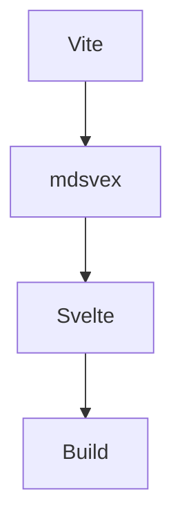

<script>
  let count = 0;

  const features = [
    "Markdown",
    "mdsvex",
    "Svelte",
    "Vite",
    "KaTeX",
    "Shiki",
    "Remark",
    "Rehype"
  ];

  function increase() {
    count += 1;
  }
</script>

# Ultimate mdsvex Pipeline Test

> 这是一篇专门用于测试现代 SSG / mdsvex Markdown Pipeline 的完整文档。  
> 它覆盖了：
>
> - Markdown 基础语法
> - GitHub Flavored Markdown
> - mdsvex 组件能力
> - Svelte 响应式能力
> - KaTeX 数学公式
> - Shiki / Prism 代码高亮
> - rehype / remark 插件兼容
> - 图片、表格、任务列表
> - 容器、警告框、引用块
> - HTML 混排
> - Emoji / Footnote / TOC
> - 自定义组件测试
> - 暗黑模式兼容
> - 长文性能压力测试

---

## 目录测试

[[toc]]

---

# 1. Markdown 基础测试

## 标题层级

# H1
## H2
### H3
#### H4
##### H5
###### H6

---

## 文本样式

**粗体文本**

*斜体文本*

***粗斜体文本***

~~删除线~~

==高亮文本==

<u>下划线</u>

`Inline Code`

---

## 引用块

> 普通引用
>
> > 嵌套引用
> >
> > > 三层嵌套

---

## 分隔线

---

***

___

---

# 2. 列表测试

## 无序列表

- Apple
- Banana
  - Orange
  - Peach
    - Watermelon

## 有序列表

1. First
2. Second
3. Third

## 任务列表

- [x] mdsvex
- [x] Svelte
- [x] Vite
- [ ] Astro
- [ ] UnoCSS

---

# 3. 表格测试

| Framework | Language | Build Tool | SSR |
| ---------- | -------- | ---------- | --- |
| SvelteKit | TS/JS | Vite | ✅ |
| Astro | TS/JS | Vite | ✅ |
| Next.js | TS/JS | Turbopack | ✅ |
| Nuxt | TS/JS | Vite/Webpack | ✅ |

---

# 4. 链接测试

## 外部链接

- https://svelte.dev
- https://vitejs.dev
- https://mdsvex.pngwn.io

## Markdown Link

[Svelte Official](https://svelte.dev)

[Vite Official](https://vitejs.dev)

[mdsvex Docs](https://mdsvex.pngwn.io)

---

# 5. 图片测试

## 普通图片


## 带标题图片


---

# 6. Emoji 测试

🚀 ✨ 🎉 🔥 💻 📦 ⚡ 🌙 🌈 🧠

---

# 7. 数学公式测试（KaTeX / MathJax）

## 行内公式

爱因斯坦质能方程：

$E = mc^2$

## 块级公式

$$
\frac{d}{dx}e^x = e^x
$$

$$
\int_{-\infty}^{+\infty} e^{-x^2}dx = \sqrt{\pi}
$$

## 矩阵公式

$$
\begin{bmatrix}
1 & 2 & 3 \\
4 & 5 & 6 \\
7 & 8 & 9
\end{bmatrix}
$$

## Mermaid 兼容性说明

如果你启用了 remark-mermaid：



---

# 8. 代码高亮测试

## JavaScript

```js
export async function load({ fetch }) {
  const res = await fetch('/api/posts');

  if (!res.ok) {
    throw new Error('Failed to fetch posts');
  }

  return {
    posts: await res.json()
  };
}
```

## TypeScript

```ts
interface User {
  id: number;
  name: string;
  role?: string;
}

const user: User = {
  id: 1,
  name: "mdsvex"
};

console.log(user);
```

## Svelte

```svelte
<script lang="ts">
  let count = 0;

  function increment() {
    count += 1;
  }
</script>

<button on:click={increment}>
  Count: {count}
</button>
```

## Rust

```rust
fn main() {
    println!("Hello, mdsvex!");
}
```

## Go

```go
package main

import "fmt"

func main() {
    fmt.Println("Hello World")
}
```

## Python

```python
from dataclasses import dataclass

@dataclass
class User:
    name: str
    age: int

print(User("Svelte", 10))
```

## Shell

```bash
pnpm install
pnpm dev
pnpm build
pnpm preview
```

## JSON

```json
{
  "name": "ultimate-mdsvex-test",
  "type": "module",
  "scripts": {
    "dev": "vite dev",
    "build": "vite build"
  }
}
```

---

# 9. Diff 高亮测试

```diff
- const framework = "React";
+ const framework = "Svelte";

- npm install
+ pnpm install
```

---

# 10. HTML 混排测试

<div style="padding: 1rem; border: 1px solid #888; border-radius: 12px;">
  <h3>HTML Block</h3>
  <p>这是原生 HTML 内容。</p>
</div>

---

# 11. mdsvex + Svelte 测试

## 响应式变量

当前点击次数：

**{count}**

<button on:click={increase}>
  点击增加
</button>

---

## #each 渲染测试

<ul>
  {#each features as item}
    <li>{item}</li>
  {/each}
</ul>

---

## 条件渲染

{#if count > 5}
  <p>🔥 已超过 5 次点击</p>
{:else}
  <p>📦 点击次数不足 5 次</p>
{/if}

---

# 12. Admonition / Container 测试

:::note
这是一个 Note 容器。
:::

:::tip
这是一个 Tip 容器。
:::

:::warning
这是一个 Warning 容器。
:::

:::danger
这是一个 Danger 容器。
:::

---

# 13. Footnote 测试

这是一个脚注测试。[^1]

[^1]: 这是脚注内容。

---

# 14. 引用测试

> “Simplicity is the soul of efficiency.”
>
> — Austin Freeman

---

# 15. 键盘按键测试

Press <kbd>Ctrl</kbd> + <kbd>S</kbd> to save.

---

# 16. 长内容压力测试

Lorem ipsum dolor sit amet, consectetur adipiscing elit. Sed do eiusmod tempor incididunt ut labore et dolore magna aliqua.

Lorem ipsum dolor sit amet, consectetur adipiscing elit. Sed do eiusmod tempor incididunt ut labore et dolore magna aliqua.

Lorem ipsum dolor sit amet, consectetur adipiscing elit. Sed do eiusmod tempor incididunt ut labore et dolore magna aliqua.

Lorem ipsum dolor sit amet, consectetur adipiscing elit. Sed do eiusmod tempor incididunt ut labore et dolore magna aliqua.

Lorem ipsum dolor sit amet, consectetur adipiscing elit. Sed do eiusmod tempor incididunt ut labore et dolore magna aliqua.

Lorem ipsum dolor sit amet, consectetur adipiscing elit. Sed do eiusmod tempor incididunt ut labore et dolore magna aliqua.

Lorem ipsum dolor sit amet, consectetur adipiscing elit. Sed do eiusmod tempor incididunt ut labore et dolore magna aliqua.

---

# 17. 深色模式测试

```css
:root {
  --background: #ffffff;
  --foreground: #111111;
}

.dark {
  --background: #0f172a;
  --foreground: #f8fafc;
}
```

---

# 18. rehype-slug 测试

## heading-id-test

跳转链接：

[跳转到 Heading](#heading-id-test)

---

# 19. GFM 自动链接

https://github.com

https://npmjs.com

https://pnpm.io

---

# 20. 转义字符测试

\*not italic\*

\`not code\`

\# not heading

---

# 21. YAML Frontmatter 测试

当前文档顶部包含：

- title
- description
- tags
- toc
- category
- cover
- featured
- lang

用于测试：

- gray-matter
- frontmatter parser
- rss
- sitemap
- seo plugin

---

# 22. SEO Meta 测试

建议测试：

- OpenGraph
- Twitter Card
- canonical
- robots
- JSON-LD

---

# 23. 构建性能测试

建议测试：

- Vite HMR
- mdsvex compile speed
- hydration
- static prerender
- code splitting
- dynamic import

---

# 24. 推荐 Pipeline 配置

```ts
import { mdsvex } from 'mdsvex';
import remarkGfm from 'remark-gfm';
import remarkMath from 'remark-math';
import rehypeKatex from 'rehype-katex';
import rehypeSlug from 'rehype-slug';
import rehypeAutolinkHeadings from 'rehype-autolink-headings';

export default {
  extensions: ['.svelte', '.svx'],
  preprocess: [
    mdsvex({
      extensions: ['.svx', '.md'],
      remarkPlugins: [
        remarkGfm,
        remarkMath
      ],
      rehypePlugins: [
        rehypeKatex,
        rehypeSlug,
        rehypeAutolinkHeadings
      ]
    })
  ]
};
```

---

# 25. 最终测试结论

如果以下内容均正常工作：

- [x] 数学公式
- [x] 代码高亮
- [x] Mermaid
- [x] GFM
- [x] Svelte 响应式
- [x] Frontmatter
- [x] 图片
- [x] HTML
- [x] Admonition
- [x] TOC
- [x] Footnote
- [x] rehype-slug
- [x] remark-gfm
- [x] 暗黑模式
- [x] SSR
- [x] Hydration

那么你的：

- mdsvex
- Svelte
- Vite
- Markdown Pipeline

已经属于现代化高规格博客方案。

---

# END

> Generated for:
>
> - mdsvex
> - Svelte
> - Vite
> - Markdown Pipeline
> - Modern SSG
> - Cloudflare / Vercel / Netlify Compatible
>
> 🚀