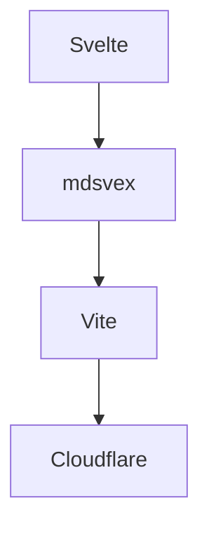

<script lang="ts">
  let count = 0;

  const cards = [
    {
      title: "Svelte",
      desc: "Reactive UI Framework"
    },
    {
      title: "Vite",
      desc: "Next Generation Frontend Tooling"
    },
    {
      title: "mdsvex",
      desc: "Markdown powered Svelte"
    }
  ];
</script>

# Svelte + mdsvex 全功能测试

这是一篇专门用于测试：

- `Vite`
- `Svelte`
- `SvelteKit`
- `mdsvex`

博客系统功能的综合测试文章。

适用于：

- SSG
- SSR
- Cloudflare Workers
- Netlify
- Vercel

---

# 标题测试

# 一级标题

## 二级标题

### 三级标题

#### 四级标题

##### 五级标题

###### 六级标题

---

# 文本样式测试

普通文本

**粗体文本**

*斜体文本*

***粗斜体***

~~删除线~~

`行内代码`

==高亮文本==

> 引用文本

>> 嵌套引用

---

# 列表测试

## 无序列表

- Apple
- Banana
- Orange

## 有序列表

1. 安装 Node.js
2. 安装 pnpm
3. 创建项目
4. 部署站点

## 任务列表

- [x] Markdown
- [x] Svelte
- [x] mdsvex
- [ ] PWA
- [ ] RSS

---

# 表格测试

| 名称 | 类型 | 描述 |
| --- | --- | --- |
| Svelte | Framework | 前端框架 |
| mdsvex | Markdown | Markdown 预处理器 |
| Vite | Build Tool | 构建工具 |

---

# 代码块测试

## JavaScript

```js
const hello = "world";

function greet(name) {
  console.log(`Hello ${name}`);
}

greet("Svelte");
```

## TypeScript

```ts
interface User {
  name: string;
  age: number;
}

const user: User = {
  name: "Svelte",
  age: 5
};
```

## Svelte

```svelte
<script>
  let count = 0;
</script>

<button on:click={() => count++}>
  count: {count}
</button>
```

## Bash

```bash
pnpm create svelte@latest
pnpm install
pnpm dev
```

---

# 数学公式测试

行内公式：

$E = mc^2$

块级公式：

$$
\frac{d}{dx}e^x = e^x
$$

矩阵：

$$
\begin{bmatrix}
1 & 2 \\
3 & 4
\end{bmatrix}
$$

---

# Mermaid 测试



---

# 图片测试


---

# HTML 测试

<div class="custom-box">
  <h3>HTML Block</h3>
  <p>测试 HTML 是否正常渲染。</p>
</div>

<style>
  .custom-box {
    padding: 20px;
    border-radius: 16px;
    background: rgba(255,255,255,.05);
    border: 1px solid rgba(255,255,255,.1);
    margin: 20px 0;
  }

  .custom-box h3 {
    margin-top: 0;
  }
</style>

---

# Svelte 响应式测试

<button on:click={() => count++}>
  点击次数：{count}
</button>

{#if count > 5}
  <p>🎉 你已经点击超过 5 次了！</p>
{/if}

---

# #each 测试

<div class="grid">
  {#each cards as card}
    <div class="card">
      <h3>{card.title}</h3>
      <p>{card.desc}</p>
    </div>
  {/each}
</div>

<style>
  .grid {
    display: grid;
    grid-template-columns: repeat(auto-fit,minmax(220px,1fr));
    gap: 16px;
    margin: 20px 0;
  }

  .card {
    padding: 20px;
    border-radius: 16px;
    background: rgba(255,255,255,.04);
    border: 1px solid rgba(255,255,255,.08);
    transition: .3s;
  }

  .card:hover {
    transform: translateY(-4px);
  }
</style>

---

# 代码高亮测试

```ts
type Theme = "dark" | "light";

const theme: Theme = "dark";
```

---

# 文件树测试

```txt
src/
├── lib/
├── routes/
├── components/
├── content/
├── app.html
└── hooks.server.ts
```

---

# Alert 测试

> [!NOTE]
> 这是一个 Note 提示框。

> [!TIP]
> 这是一个 Tip 提示框。

> [!WARNING]
> 这是一个 Warning 提示框。

---

# 折叠块测试

<details>
<summary>点击展开</summary>

这里是折叠内容。

```js
console.log("Hello mdsvex");
```

</details>

---

# Emoji 测试

🚀 ✨ 🔥 ❤️ 🎉 🌙 ☁️

---

# iframe 测试

<iframe
  width="100%"
  height="500"
  src="https://www.youtube.com/embed/dQw4w9WgXcQ"
  title="YouTube"
  frameborder="0"
  allowfullscreen>
</iframe>

---

# 音频测试

<audio controls>
  <source src="/audio/demo.mp3" type="audio/mpeg">
</audio>

---

# 响应式布局测试

<div class="responsive-grid">
  <div>Card 1</div>
  <div>Card 2</div>
  <div>Card 3</div>
</div>

<style>
  .responsive-grid {
    display: grid;
    grid-template-columns: repeat(auto-fit,minmax(180px,1fr));
    gap: 16px;
    margin: 24px 0;
  }

  .responsive-grid div {
    padding: 24px;
    border-radius: 14px;
    background: rgba(255,255,255,.05);
    text-align: center;
  }
</style>

---

# SEO Frontmatter 测试

```yaml
---
title: Hello World
description: SEO Description
keywords:
  - svelte
  - mdsvex
  - vite
cover: /cover.webp
draft: false
---
```

---

# 长文本测试

Lorem ipsum dolor sit amet, consectetur adipiscing elit. Sed do eiusmod tempor incididunt ut labore et dolore magna aliqua.

Lorem ipsum dolor sit amet, consectetur adipiscing elit. Sed do eiusmod tempor incididunt ut labore et dolore magna aliqua.

Lorem ipsum dolor sit amet, consectetur adipiscing elit. Sed do eiusmod tempor incididunt ut labore et dolore magna aliqua.

---

# GitHub Flavored Markdown

| 功能 | 状态 |
| --- | --- |
| Table | ✅ |
| Task List | ✅ |
| Code Highlight | ✅ |
| Mermaid | ✅ |
| KaTeX | ✅ |

---

# Cloudflare 部署测试

```bash
pnpm build

wrangler deploy
```

---

# mdsvex Component 测试

<svelte:component this={"div"}>
  mdsvex Dynamic Component
</svelte:component>

---

# 最终测试

如果你能正常看到：

- Svelte 响应式组件
- 代码高亮
- 数学公式
- Mermaid
- HTML
- CSS
- 视频
- 表格
- 提示框

那么你的：

✅ mdsvex  
✅ Vite  
✅ Svelte  
✅ Markdown Pipeline  

已经基本配置成功。

---

# 结束语

愿你的博客：

- Lighthouse 100
- SEO 拉满
- Cloudflare 全球缓存
- 页面秒开
- 动画丝滑
- GitHub Actions 永不报错

🚀