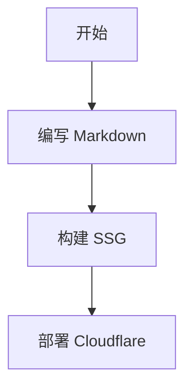
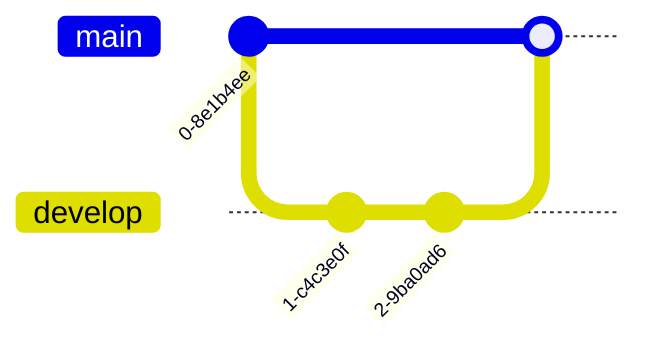
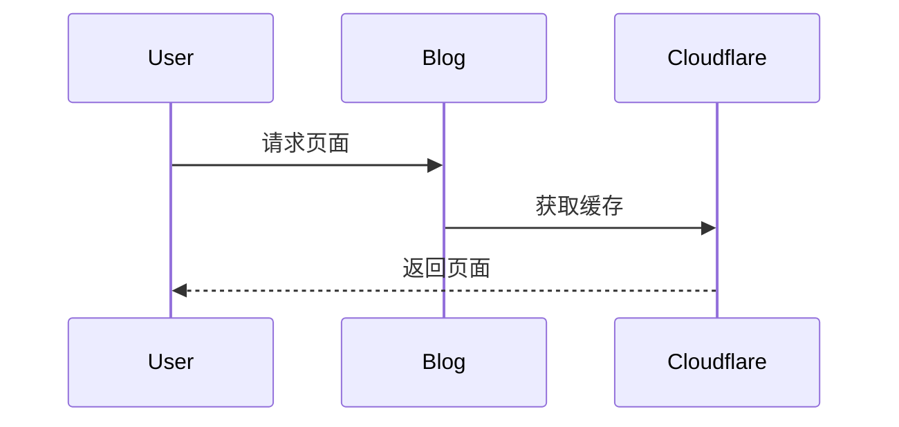

# SSG 博客 Markdown 全功能测试

欢迎来到这篇专门用于测试 **SSG（Static Site Generator）** 博客功能的文章。

适用于：

- Astro
- VitePress
- Hugo
- Hexo
- VuePress
- Next.js
- Nuxt Content
- Docusaurus

本文将尽可能覆盖各种 Markdown 扩展能力，用于测试：

- Markdown 渲染
- 代码高亮
- 暗黑模式
- Mermaid
- KaTeX / MathJax
- 图片懒加载
- 表格样式
- GitHub Alert
- MDX
- Admonition
- RSS 摘要
- SEO
- TOC
- 多语言
- 评论系统
- 阅读时间
- 链接卡片
- 自定义组件
- Shiki 代码主题
- PrismJS
- Twoslash
- Copy Code
- Tabs
- 折叠块

---

# 一级标题

## 二级标题

### 三级标题

#### 四级标题

##### 五级标题

###### 六级标题

---

# 文本样式测试

这是普通文本。

**这是粗体**

*这是斜体*

***这是粗斜体***

~~这是删除线~~

`这是行内代码`

<u>这是下划线（HTML）</u>

==这是高亮文本==

> 这是引用块。

>> 这是嵌套引用。

---

# 分割线测试

---

***

___

---

# 列表测试

## 无序列表

- Apple
- Banana
- Orange

### 嵌套列表

- 前端
  - HTML
  - CSS
  - JavaScript
- 后端
  - Node.js
  - Go
  - Rust

## 有序列表

1. 安装 Node.js
2. 安装 pnpm
3. 创建项目
4. 部署站点

## 任务列表

- [x] Markdown 支持
- [x] Mermaid 支持
- [x] 数学公式
- [ ] PWA
- [ ] 离线缓存

---

# 链接测试

## 普通链接

[GitHub](https://github.com)

## 自动链接

https://astro.build

## 邮件链接

<test@example.com>

---

# 图片测试

## 普通图片


## 带标题图片


## HTML 图片


---

# 表格测试

| 名称 | 类型 | 描述 |
| --- | --- | --- |
| Astro | SSG | 现代静态站点生成器 |
| VitePress | 文档 | Vue 驱动文档框架 |
| Hugo | Go | 超快静态博客 |
| Hexo | Node.js | 经典博客系统 |

## 对齐测试

| 左对齐 | 居中 | 右对齐 |
| :--- | :---: | ---: |
| A | B | C |
| 1 | 2 | 3 |

---

# 代码块测试

## HTML

```html
<!DOCTYPE html>
<html lang="zh-CN">
<head>
  <meta charset="UTF-8" />
  <title>Hello World</title>
</head>
<body>
  <h1>Hello SSG</h1>
</body>
</html>
```

## CSS

```css
:root {
  --primary: #3b82f6;
}

body {
  background: #0f172a;
  color: white;
  font-family: sans-serif;
}
```

## JavaScript

```javascript
const message = "Hello Markdown";

function greet(name) {
  console.log(`Hello ${name}`);
}

greet("SSG");
```

## TypeScript

```ts
interface User {
  name: string;
  age: number;
}

const user: User = {
  name: "Astro",
  age: 5
};
```

## Bash

```bash
pnpm create astro@latest
cd my-blog
pnpm install
pnpm dev
```

## JSON

```json
{
  "name": "my-blog",
  "version": "1.0.0",
  "scripts": {
    "dev": "astro dev",
    "build": "astro build"
  }
}
```

## YAML

```yaml
title: Hello World
description: Markdown Test
tags:
  - astro
  - markdown
```

## Diff

```diff
- old code
+ new code
```

---

# 数学公式测试

## 行内公式

爱因斯坦公式：$E = mc^2$

## 块级公式

$$
\frac{d}{dx}e^x = e^x
$$

## 矩阵

$$
\begin{bmatrix}
1 & 2 \\
3 & 4
\end{bmatrix}
$$

## 积分

$$
\int_{0}^{\infty} e^{-x} dx = 1
$$

---

# Mermaid 测试

## 流程图



## Git 分支图



## 时序图



---

# 提示框测试

> [!NOTE]
> 这是一个 Note 提示框。

> [!TIP]
> 这是一个 Tip 提示框。

> [!IMPORTANT]
> 这是一个 Important 提示框。

> [!WARNING]
> 这是一个 Warning 提示框。

> [!CAUTION]
> 这是一个 Caution 提示框。

---

# 折叠块测试

<details>
<summary>点击展开内容</summary>

这里是隐藏内容。

支持：

- Markdown
- 代码块
- 图片
- 列表

```js
console.log("Hello");
```

</details>

---

# Emoji 测试

😀 😎 🚀 🎉 ❤️ 🔥 ✨ 📦 🌙 ☁️

---

# 引用测试

> Stay hungry, stay foolish.
>
> — Steve Jobs

---

# 键盘按键测试

<kbd>Ctrl</kbd> + <kbd>C</kbd>

<kbd>Shift</kbd> + <kbd>Alt</kbd> + <kbd>F</kbd>

---

# HTML 混写测试

<div style="padding: 20px; border-radius: 12px; background: #111827;">
  <h3 style="color: #60a5fa;">HTML Card</h3>
  <p>测试 HTML 在 Markdown 中是否正常渲染。</p>
</div>

---

# Footnotes 测试

这里有一个脚注[^1]

[^1]: 这是脚注内容。

---

# Definition List 测试

Markdown
: 一种轻量级标记语言

SSG
: 静态站点生成器

---

# Tabs 测试（部分主题支持）

:::tabs

@tab pnpm

```bash
pnpm install
```

@tab npm

```bash
npm install
```

@tab yarn

```bash
yarn
```

:::

---

# 代码高亮测试

```ts twoslash
const hello: string = "world"
```

---

# 自定义组件测试

<Component name="Alert">
  自定义 MDX 组件内容
</Component>

---

# 多语言测试

## English

Hello World.

## 日本語

こんにちは世界。

## 中文

你好，世界。

## 한국어

안녕하세요 세계.

---

# 长文本测试

Lorem ipsum dolor sit amet, consectetur adipiscing elit. Sed do eiusmod tempor incididunt ut labore et dolore magna aliqua.

Lorem ipsum dolor sit amet, consectetur adipiscing elit. Sed do eiusmod tempor incididunt ut labore et dolore magna aliqua.

Lorem ipsum dolor sit amet, consectetur adipiscing elit. Sed do eiusmod tempor incididunt ut labore et dolore magna aliqua.

Lorem ipsum dolor sit amet, consectetur adipiscing elit. Sed do eiusmod tempor incididunt ut labore et dolore magna aliqua.

---

# SEO 测试字段

```yaml
---
title: SEO Title
description: SEO Description
keywords:
  - blog
  - astro
  - markdown
ogImage: /og.png
twitterCard: summary_large_image
---
```

---

# 引用外部资源测试

- CDNJS
- jsDelivr
- unpkg
- Cloudflare CDN

---

# 视频嵌入测试

<iframe
  width="100%"
  height="500"
  src="https://www.youtube.com/embed/dQw4w9WgXcQ"
  title="YouTube video"
  frameborder="0"
  allowfullscreen>
</iframe>

---

# 音频测试

<audio controls>
  <source src="/audio/demo.mp3" type="audio/mpeg">
</audio>

---

# 响应式测试

<div style="display:grid;grid-template-columns:repeat(auto-fit,minmax(200px,1fr));gap:16px;">
  <div style="background:#1e293b;padding:20px;border-radius:12px;">Card 1</div>
  <div style="background:#1e293b;padding:20px;border-radius:12px;">Card 2</div>
  <div style="background:#1e293b;padding:20px;border-radius:12px;">Card 3</div>
</div>

---

# GFM 测试

| 功能 | 支持 |
| --- | --- |
| Table | ✅ |
| Task List | ✅ |
| Strikethrough | ✅ |
| Autolink | ✅ |

---

# 引入代码文件测试

```js title="src/main.js"
console.log("Hello File Title");
```

---

# 行高亮测试

```js {2,4}
const a = 1;
const b = 2;
const c = 3;
console.log(a + b + c);
```

---

# 文件树测试

```txt
project/
├── src/
│   ├── pages/
│   ├── components/
│   └── layouts/
├── public/
├── astro.config.mjs
└── package.json
```

---

# 部署信息测试

| 平台 | 状态 |
| --- | --- |
| Cloudflare Workers | ✅ |
| Vercel | ✅ |
| Netlify | ✅ |
| GitHub Pages | ✅ |

---

# RSS 测试

```xml
<rss version="2.0">
  <channel>
    <title>My Blog</title>
  </channel>
</rss>
```

---

# 最终测试

如果你能完整看到本文内容，说明：

- Markdown 渲染正常
- 样式加载正常
- 代码高亮正常
- 数学公式正常
- Mermaid 正常
- HTML 混写正常
- 图片正常
- 响应式正常

---

# 结束语

感谢测试你的 SSG 博客系统。

愿你的：

- Lighthouse 满分
- SEO 爆炸
- 页面秒开
- Cloudflare 缓存命中率 100%
- GitHub Actions 永不报错

🚀